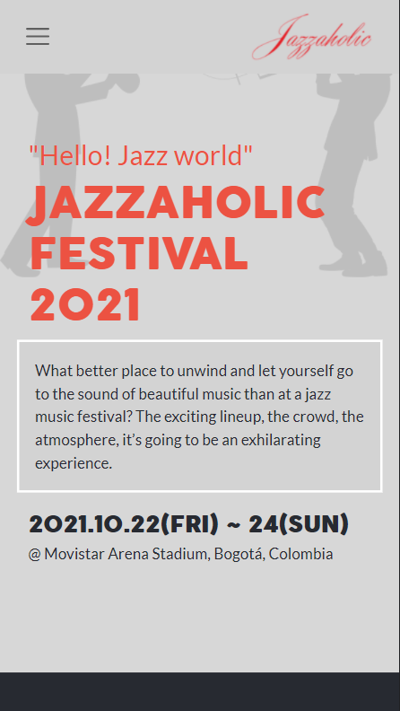
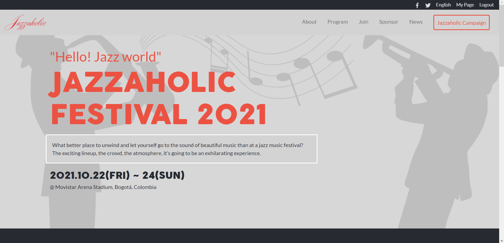

# Jazzaholic

This project consists in building an event page based on an [online website for a conference](https://www.behance.net/gallery/29845175/CC-Global-Summit-2015). I chose to build it about a fictional Jazz Festival: Jazzaholic, which happens every year in Bogotá, Colombia. The pictures are taken from the internet and the text is made up, so they don't represent a real event in any way.

## Mobile

## Desktop

## Built With

- HTML5
- CSS3
- Bootstrap
- Visual Studio Code
- Git & Github

## Live Demo

[Live Demo Link](https://dicodiaz.me/jazzaholic/)

## Getting Started

To get a local copy up and running follow these simple example steps.

- Clone repo into your machine. For this, I recommend the following steps:
  - Open a terminal of your choice (e.g. VS Code integrated terminal)
  - Select the destination folder (On windows, run cd "_Destination folder_")
  - Run `git clone https://dicodiaz.me/jazzaholic/`
- Open the destination folder in your preferred file explorer
- Open folder "jazzaholic"
- Open index.html

### Prerequisites

Any modern web browser will do.

### Setup

Follow the steps described before.

## Author

👤 **Dico Diaz Dussan**

- GitHub: [@dicodiaz](https://github.com/dicodiaz)
- Twitter: [@DicoDiaz1](https://twitter.com/DicoDiaz1)
- LinkedIn: [Dico Diaz Dussan](https://www.linkedin.com/in/dico-diaz-dussan)

## 🤝 Contributing

Contributions, issues, and feature requests are welcome!

Feel free to check the [issues page](../../issues/).

## Show your support

Give a ⭐️ if you like this project!

## Acknowledgments

- Design idea by [Cindy Shin | GUI & Graphic Designer](https://www.behance.net/adagio07)

## 📝 License

This project is [MIT](./MIT.md) licensed.
